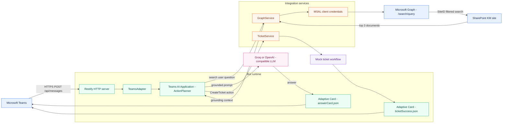
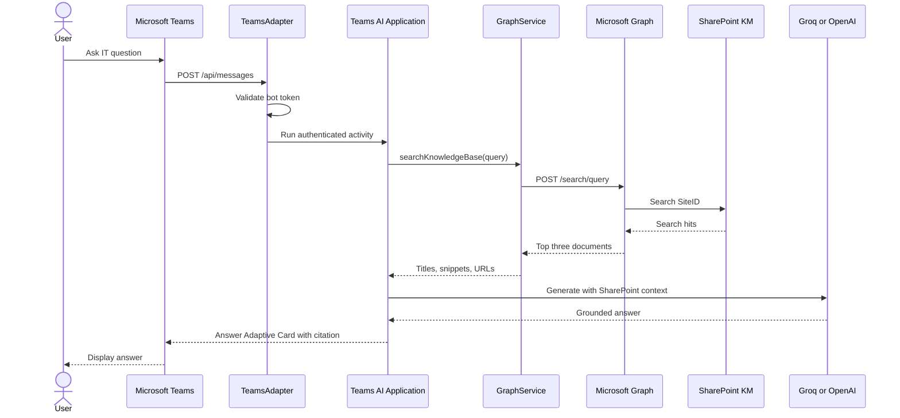
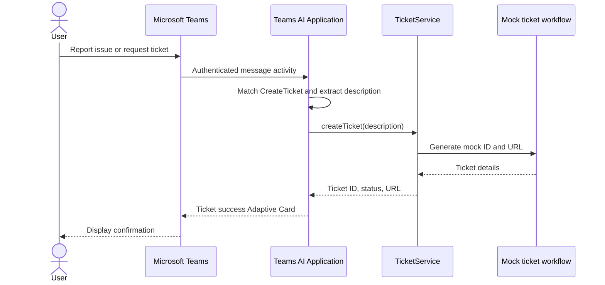

# High-Level Design (HLD)

## 1. Purpose and scope

The Microsoft Teams Helpdesk AI Bot provides a conversational interface for IT support. It
retrieves relevant documents from a SharePoint KM site, supplies those documents as context to an
OpenAI-compatible language model, and returns a grounded answer in Teams. It also recognizes a
`CreateTicket` action and returns a ticket confirmation.

This design covers the current Node.js and TypeScript implementation. Ticket creation is a mock
workflow and is not a production service-management integration.

## 2. Goals

- Provide a Teams-native helpdesk experience.
- Answer knowledge questions using SharePoint as the authoritative source.
- Reduce hallucination through explicit prompt grounding rules.
- Support Indonesian and English responses.
- Provide source links in answer cards.
- Keep retrieval, AI orchestration, and ticketing independently replaceable.
- Support local development through an HTTPS tunnel.

## 3. Non-goals

- Storing or indexing documents in a custom vector database.
- Replacing SharePoint permissions or search indexing.
- Implementing a real ITSM ticketing system in the current version.
- Providing a web frontend outside Teams.
- Supporting multi-instance durable conversation state in the current version.

## 4. Logical architecture

The diagram below uses Mermaid, so it renders natively in GitHub and in Markdown viewers that
support Mermaid.

## 5. Main components

### Teams and Bot Framework

Teams sends an activity to the Bot Framework messaging endpoint. `TeamsAdapter` validates the
incoming token using the configured bot App ID, client secret, and tenant ID.

### Restify server

`src/index.ts` creates the HTTP server, enables body parsing, exposes `/health`, and forwards
`POST /api/messages` to `app.run(context)`.

### Teams AI application

`src/app.ts` initializes the model, prompt manager, action planner, memory storage, message
interceptors, and AI actions. It adds retrieval results to the prompt before the planner generates
the response.

### GraphService

`src/services/graphService.ts` uses MSAL client credentials to acquire a Microsoft Graph token and
calls `/search/query` with a `SiteID` filter. It returns a maximum of three documents with title,
snippet, and URL.

### Adaptive Cards

Card templates in `src/cards/` define response presentation. `cardHelper.ts` replaces runtime
placeholders for answer and ticket-success cards.

### TicketService

`src/services/ticketService.ts` validates a description and returns a generated mock ticket. It is
the extension point for a real Power Automate, ServiceNow, or Jira integration.

## 6. Request flows

### Knowledge question

### Ticket request

## 7. Trust boundaries

- Teams-to-bot traffic is authenticated by Bot Framework.
- Graph access uses an application identity and must be restricted by tenant permissions.
- SharePoint snippets are untrusted data and are explicitly marked as reference context.
- LLM output is not treated as an instruction to execute code.
- Secrets are supplied through environment variables and must be managed outside Git.

## 8. Deployment topology

### Development

The Node.js process runs locally. Dev Tunnels or an approved equivalent exposes port `3978` over
HTTPS. The Teams app points to the tunnel’s `/api/messages` endpoint.

### Production target

Run the compiled Node.js service on an HTTPS-capable hosting platform behind a managed identity or
secret store. Configure a stable Bot Framework messaging endpoint, durable state storage, central
logging, health monitoring, and controlled secret rotation.

## 9. Key design decisions

- Microsoft Graph Search is used instead of an external vector database because SharePoint is the
  system of record.
- Groq is supported through its OpenAI-compatible endpoint; OpenAI remains a fallback provider.
- Adaptive Cards provide Teams-native rich responses.
- Memory storage is acceptable for a single local process but must be replaced for scale-out.
- Ticket creation is isolated so the mock can be replaced without changing prompt or card logic.

## 10. Quality attributes and risks

- **Security:** Protect bot, Graph, and LLM credentials; use least-privilege Graph permissions.
- **Reliability:** Handle Graph and LLM failures with a safe fallback response.
- **Traceability:** Include source URLs in answer cards and structured operational logs.
- **Latency:** Graph search and LLM generation are both on the synchronous message path.
- **Scalability:** In-memory state and process-local configuration currently limit horizontal scale.
- **Content quality:** Answers depend on SharePoint indexing, document quality, and search relevance.
- **Lifecycle:** `@microsoft/teams-ai` v1 is deprecated and should be migrated when practical.

## 11. Alternative platform architecture

The solution can be migrated to a Microsoft 365 Copilot Declarative Agent when the organization
prefers Microsoft-managed model orchestration, SharePoint knowledge configuration, and Power
Automate actions. This removes the need for Groq/OpenAI keys in the agent runtime but changes the
custom bot, Graph retrieval, and Adaptive Card implementation.

See [Microsoft 365 Copilot Alternative](m365-copilot-alternative.md) for the comparison,
decision guidance, and migration outline. A Custom Engine Agent can expose the existing bot
through Microsoft 365 Copilot, but it still uses the application's selected model provider.
