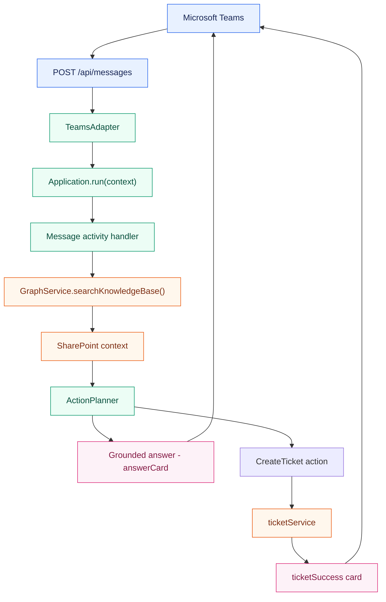

# Architecture

## Overview

The bot uses a Restify HTTP server, the Microsoft Teams AI Library for orchestration, Microsoft
Graph for SharePoint retrieval, and Adaptive Cards for rich Teams responses.

## Components

### `src/index.ts`

Creates the Restify server and `TeamsAdapter`. Incoming Bot Framework activities are forwarded
to `app.run(context)`. The `/health` endpoint is available for service health checks.

### `src/app.ts`

Owns the Teams AI application:

- Loads the default prompt.
- Searches the SharePoint Knowledge Management repository for each message.
- Adds retrieved document titles, snippets, and URLs to the system prompt.
- Registers the `CreateTicket` action.
- Converts AI answers and ticket confirmations into Adaptive Cards.

### `src/services/graphService.ts`

Uses MSAL client credentials to acquire an application token for Microsoft Graph. It sends a
`POST /search/query` request with a `SiteID` KQL filter and maps the response to a maximum of
three documents:

- `title`
- `snippet`
- `webUrl`

### `src/services/ticketService.ts`

Provides the current mock ticket workflow. It validates the issue description, waits briefly to
simulate a webhook call, and returns a generated mock ticket ID and URL.

### `src/cards/` and `src/utils/cardHelper.ts`

The JSON files define the Adaptive Card layouts. `cardHelper.ts` clones each template and replaces
`${property}` placeholders with runtime data.

## Message flow

## Grounding behavior

The prompt contains explicit instructions to use only the retrieved SharePoint context. When no
matching document is found or the search fails, the model is told not to use general knowledge
and to return the Knowledge Management fallback message.

SharePoint content is treated as reference data, not as executable instructions. This helps keep
retrieved text from changing the bot's system-level behavior.

## Production considerations

- Replace `MemoryStorage` with durable storage before running multiple bot instances.
- Replace the mock ticket service with an authenticated Power Automate webhook.
- Add application telemetry and structured logging.
- Restrict Graph permissions to the minimum required scope.
- Migrate from the deprecated Teams AI Library v1 when the surrounding bot code is ready.
