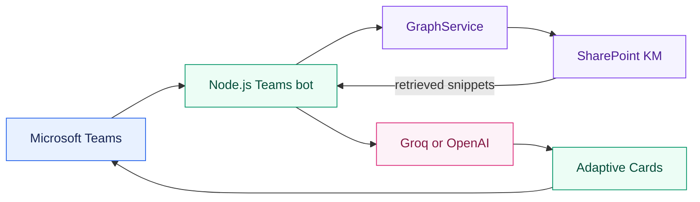
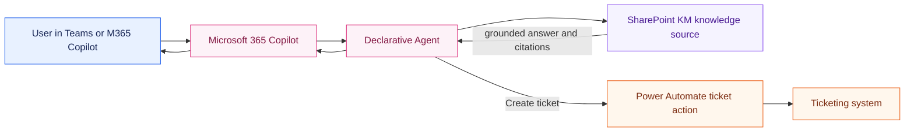

# Alternative: Microsoft 365 Copilot Native Model

## 1. Purpose

This document compares the current custom Teams bot with an alternative implementation using the
model and orchestration provided by Microsoft 365 Copilot. It is intended to support an
architecture decision before changing the implementation.

## 2. Important distinction

Microsoft 365 Copilot is not an OpenAI-compatible endpoint. It cannot be enabled in the current
application by only changing `OPENAI_BASE_URL`, and the current `OpenAIModel` cannot directly use
the model behind a user's Microsoft 365 Copilot license.

There are two Microsoft agent approaches:

### Declarative Agent

A Declarative Agent runs inside the Microsoft 365 Copilot experience and uses Copilot's built-in
orchestration and language models. Instructions, SharePoint knowledge, connectors, and actions
are configured rather than implemented as the current Node.js LLM pipeline.

This is the recommended approach when the primary requirements are SharePoint question answering,
Microsoft 365 governance, and Power Automate actions.

### Custom Engine Agent

A Custom Engine Agent can be exposed through Microsoft 365 Copilot while the developer retains
control of the bot, orchestration, APIs, and language model. The current application could be
adapted for this approach, but it would still need Groq, OpenAI, Azure OpenAI, or another
supported model service.

Adding the Copilot channel therefore does not remove the current model API requirement.

## 3. Current implementation

The current implementation provides:

- Custom TypeScript orchestration through `@microsoft/teams-ai`.
- SharePoint retrieval through Microsoft Graph `/search/query`.
- Explicit prompt grounding and a controlled fallback message.
- Custom Adaptive Card layouts and citation URLs.
- A `CreateTicket` action with a mock ticket service.
- Choice of Groq or OpenAI-compatible model providers.

It requires a bot App ID, a matching client secret, Graph application credentials, and an AI
provider key.

## 4. Native Microsoft 365 Copilot alternative

In this model, SharePoint is configured as a knowledge source and ticket creation is exposed as
an action or Power Automate flow. The Node.js `OpenAIModel`, custom Graph token flow, and custom
answer-card pipeline are not required for the basic agent experience.

## 5. Benefit comparison

### Model and API keys

**Current custom bot**

- Requires `GROQ_API_KEY` or `OPENAI_API_KEY`.
- The development team selects the model and endpoint.
- Model usage and provider availability are managed by the application team.

**Native M365 Copilot**

- Does not require a Groq or OpenAI API key in the agent application.
- Uses the Microsoft 365 Copilot model and orchestration.
- Licensing, capacity, and availability are controlled by the Microsoft 365 tenant.

### SharePoint RAG

**Current custom bot**

- Retrieval is explicitly implemented in `GraphService`.
- The application controls the Graph query, result count, context format, and prompt rules.
- The application can implement custom ranking or additional data sources.

**Native M365 Copilot**

- SharePoint can be configured as the agent's knowledge source.
- Microsoft controls much of the retrieval, grounding, and citation experience.
- There is less code to maintain, but less control over the exact query and prompt pipeline.

### Ticketing workflow

**Current custom bot**

- `CreateTicket` is a code-defined action.
- The current implementation is only a mock and returns a generated ticket ID.
- A developer controls validation, API calls, retries, and card output.

**Native M365 Copilot**

- Power Automate can provide a low-code ticketing action.
- Connectors, approvals, authentication, and business rules can be managed in Microsoft 365.
- Power Automate licensing, connector limits, and tenant policies still apply.

### User experience

**Current custom bot**

- Full control over Adaptive Card JSON, titles, buttons, fallback text, and response formatting.
- Can preserve the existing custom Teams bot behavior.

**Native M365 Copilot**

- Works in the standard Microsoft 365 Copilot experience.
- Reduces custom UI maintenance.
- Native citation and action presentation may differ from the current Adaptive Cards.

### Security and governance

**Current custom bot**

- The team must protect Bot Framework credentials, Graph secrets, and model API keys.
- Graph application permissions and prompt/data handling are controlled in code and Entra.
- Operational security depends on the hosting platform and secret management.

**Native M365 Copilot**

- Benefits from Microsoft 365 identity, tenant governance, and Copilot administration.
- Reduces the number of application-managed secrets.
- Tenant administrators still control publishing, data access, licensing, connectors, and consent.

### Development and operations

**Current custom bot**

- Requires Node.js hosting, tunnel or public endpoint, dependency maintenance, and logging.
- Best for custom orchestration, multiple integrations, or requirements outside Copilot.

**Native M365 Copilot**

- Faster for standard knowledge and workflow scenarios.
- Less custom backend code to operate.
- Requires agent configuration, tenant deployment, licensing checks, and administrator approval.

## 6. Decision guidance

Choose a **Declarative Agent** when:

- SharePoint is the primary knowledge source.
- The team wants to avoid Groq/OpenAI API keys in the application.
- Standard Microsoft 365 Copilot responses and citations are acceptable.
- Ticket creation can be implemented with Power Automate or a supported connector.
- Tenant administrators can approve the agent, knowledge access, and licensing.

Keep the **current custom bot** when:

- Custom Adaptive Cards are a hard requirement.
- The team needs full control over retrieval, prompts, ranking, or response behavior.
- The solution will integrate with multiple external systems.
- The team needs to choose or switch between model providers.
- The bot must run outside Microsoft 365 Copilot or support custom multi-channel behavior.

Use a **Custom Engine Agent** when:

- The current bot should be discoverable through Microsoft 365 Copilot.
- Custom code, Graph retrieval, and ticketing logic must be preserved.
- The team accepts that Groq, OpenAI, Azure OpenAI, or another model service remains necessary.

## 7. Migration outline to a Declarative Agent

1. Confirm Microsoft 365 Copilot or Copilot Studio licensing and tenant availability.
2. Obtain administrator approval for publishing and SharePoint access.
3. Create a Declarative Agent in Copilot Studio or Microsoft 365 Agents Toolkit.
4. Configure the SharePoint KM site as the knowledge source.
5. Move the bilingual tone and grounding instructions into the agent instructions.
6. Create a Power Automate flow for `CreateTicket`.
7. Define required inputs such as issue description, asset ID, impact, and urgency.
8. Configure authentication and least-privilege access for the ticketing connector.
9. Test grounded answers, missing information, citations, and ticket failures.
10. Pilot with a limited audience before publishing broadly.
11. Decide whether the current custom Teams bot should be retired or retained for advanced workflows.

## 8. Impact on this repository

If the project migrates fully to a Declarative Agent:

- `src/app.ts` and `src/index.ts` would no longer be the primary Copilot runtime.
- `OpenAIModel`, Groq/OpenAI variables, and custom prompt orchestration would be removed from the
  agent deployment.
- `GraphService` could be retired for basic SharePoint knowledge retrieval.
- `ticketService.ts` would be replaced by a Power Automate flow or supported connector.
- Adaptive Card templates would no longer define the complete Copilot response experience.
- This repository could remain as a reference or be repurposed for custom APIs and advanced actions.

If the project is exposed as a Custom Engine Agent, most current modules remain, and the external
model and bot credentials are still required.

## 9. Prerequisites and limitations

Native Copilot does not eliminate all Microsoft 365 administration. The organization may still
need to provide:

- Microsoft 365 Copilot or Copilot Studio licensing/capacity.
- Permission to create and publish agents.
- SharePoint knowledge access and appropriate data governance.
- Power Automate or connector licensing for ticket creation.
- Admin approval for deployment and user access.

The final licensing and feature availability depend on the tenant, region, purchased plans, and
Microsoft service configuration.

## 10. References

- [Agents overview](https://learn.microsoft.com/en-us/microsoft-365/copilot/extensibility/agents-overview)
- [Custom engine agents overview](https://learn.microsoft.com/en-us/microsoft-365/copilot/extensibility/overview-custom-engine-agent)
- [Custom engine agent architecture](https://learn.microsoft.com/en-us/microsoft-365/copilot/extensibility/custom-engine-agent-architecture)
- [Enable a Teams app in Microsoft 365 Copilot](https://learn.microsoft.com/en-us/microsoftteams/platform/teams-sdk/teams/enabling-in-copilot)
